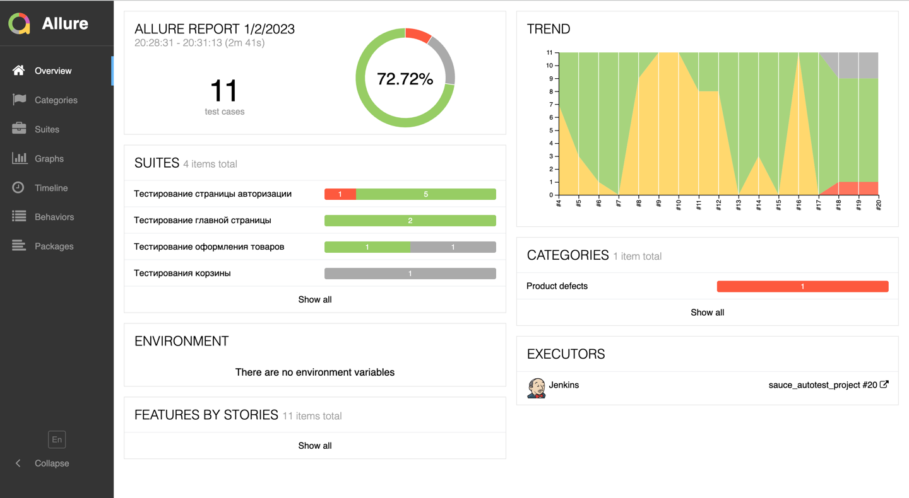

# Проект по автоматизации тестирования [SauceLabs](https://saucedemo.com/) 


<a id="lift"></a>
## Содержание :clipboard:

* <a href="#description">Описание проекта и особенности</a>
* <a href="#stack">Cтек технологий</a>
* <a href="#objects">Реализованные проверки</a>
* <a href="#gradle">Запуск тестов</a>
    + <a href="#gradle">Gradle</a>
    + <a href="#jenkins">Jenkins</a>
* <a href="#screenshot">Скриншоты и видео</a>
    + <a href="#selenoid">Selenoid</a>
    + <a href="#jenkins">Jenkins</a>
    + <a href="#allure">Allure TestOps, Allure Report</a>
    + <a href="#notifications">Telegram, Email</a>

# <a id="description">Описание</a>

Проект включает в себя UI-тесты.\
Некоторые факты о проекте:

- [x] На проекте используется паттерн `PageObject`
- [x] Генерация данных с помощью библиотеки `Faker`
- [x] Запуск тестов с различными конфигурациями
- [x] Для конфигурации используется библиотека `Owner`
- [x] Интегрирован `Allure TestOps`
- [x] Интегрирован `Jira` 
- [x] Реализована отправка уведомлений в `Telegram`

# <a id="stack">Технологии и инструменты</a>

<p  align="center">
  <code></code>
  <code></code>
  <code></code>
  <code></code>
  <code></code>
  <code></code>
  <code></code>
  <code></code>
  <code></code>
  <code></code>
  <code></code>
  <code></code>
</p>

>* Автотесты написаны на `Java` с использованием фреймворка `Selenide`
>* Фреймворк для модульного тестирования `JUnit`
>* Для автоматизации сборки проекта исопльзуется `Gradle`
>* Для параллельного запуска тестов используется `Selenoid`
>* Сборка проекта в CI/CD `Jenkins`
>* Формирование отчета в `Allure Report`
>* Отчеты отправляются в `Telegram`

# <a id="objects">Реализованные проверки</a>

1. [ ] _Отсутствие ошибок в консоли на всех страницах_
2. [ ] _Успешная авторизация на сайте_
3. [ ] _Ошибка авторизации при пустом логине и пароле_
4. [ ] _Ошибка авторизации при пустом пароле_
5. [ ] _Ошибка авторизации за заблокированного пользователя_
6. [ ] _Ошибка авторизации при неверном логине или пароле_
7. [ ] _Товары добавляются в корзину_
8. [ ] _Возможно завершить все этапы оформления товаров_

# <a id="gradle">Запуск тестов из терминала</a>

```bash
gradle clean test -Dthreads=4
```
**Доступные свойства для запуска**
>`threads` - количество потоков для параллельного запуска \
>`browserSize` - размер окна браузера. По-умолчанию 1920х1080 \
>`browserVersion` - версия браузера


# <a id="jenkins">Запуск тестов в Jenkins</a>

Параметры запуска:
<p align="center">
  
</p>

После завершения сборки результаты тестов доступны в:
> `Allure Report` \
> `Allure TestOps` - результаты подгружаются автоматически и также обновляются при изменении кода

<p align="center">
  
</p>

# <a id="allure">Отчет о результатах тестирования в Allure Report</a>

Главная страница `Allure Report` включает в себя:
> `ALLURE REPORT` - дата и время проведения тестов,а также диаграмму с указанием процента и количества успешных, 
> упавших и сломавшихся в процессе выполнения тестов \
> `TREND` - тенденция выполнения для всех запусков \
> `SUITES` - отображение тестов по тестовым наборам \
> `CATEGORIES` - отображение тестов по категориям 

<p align="center">
  
</p>

На странице `Suites` можно посмотреть информацию о тестах:

<p align="center">
  
</p>

Также там доступны тестовые артефакты:
> * _Скриншоты_
> * _Логи_
> * _Видео_


[Вернуться наверх ⬆](#lift)